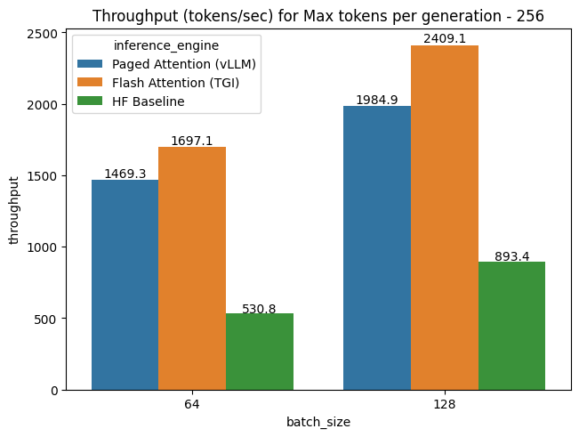
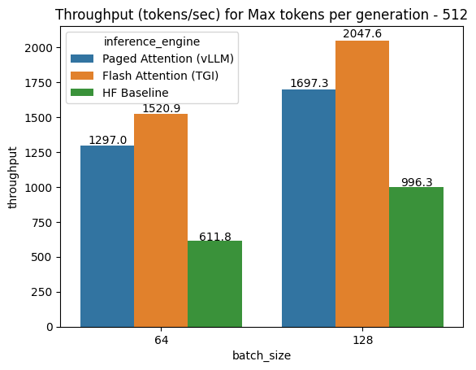
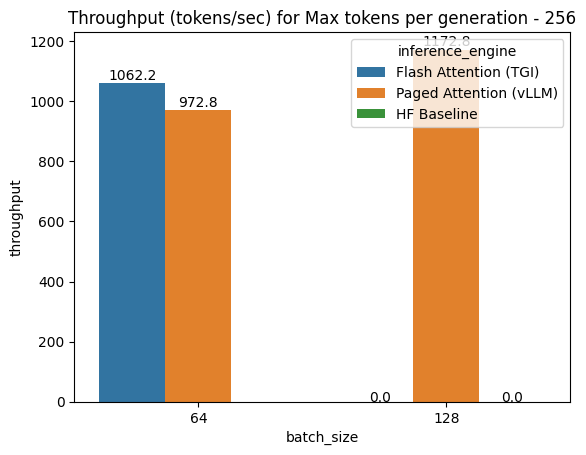
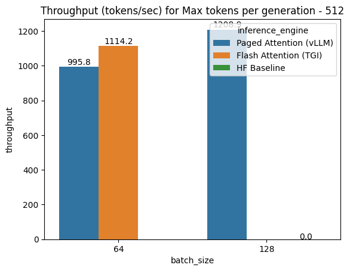

# WizardCorder/Starcoder Benchmark

Repo to benchmark inference optimizations for WizardCoder / Starcoder model.

Note: All benchmarks reported are run in A100 40GB instance and with `WizardLM/WizardCoder-15B-V1.0`.

## Installation steps:

```
git clone https://github.com/infinitylogesh/Wizcoder_benchmark.git
cd Wizcoder_benchmark/scripts && make install-vllm && make install-tgi && make install-flash-attn
```

## Usage:

To run the benchmark for a specific inference engine:

```bash
python3 main.py --batch_size <BATCH-SIZE> --num_tokens <NUM-TOKENS-TO_GENERATE> --inference_engine <INFERENCE-ENGINE>
```

Values of `INFERENCE-ENGINE` can be:
- `hf`: Vanilla hf inference
- `tgi`: Flash attention using HF's Text-generation-inference
- `vllm`: Paged Attention using vLLM
- `hf_pipeling`: Inference using huggingface pipeline 

To run the complete benchmark:

```bash
sh scriots/run_benchmark.sh
```
## Results:

- **Flash Attention** (Implemented from Text-generation-inference) Performs the best in various setting. However, with long sequences(especially with long input sequences), It seems to result into OOM

- **Paged Attention** (via vLLM) - Performs second best in our benchmark runs and It is better at handling long sequences even in the settings where Flash attention fails , vLLM completes the generation without OOM

- **HF Generate** (baseline) - Huggingface's venilla `AutoModelForCausalLM` taken as a baseline.

- **HF Pipeline** - Huggingface's Pipeline for text-generation performed the worst of all (Results are to be added). 


### Results with short sequence inputs

<p float="left">
  
    
</p>

### Results with long sequence inputs

- With Batch size of 64 , HF baseline throwed OOM. Flash attention performed better than Paged attention.
- With Batch size of 128, Both HF and Flash attention throwed OOM. Paged attention completed the generations.

<p float="left">
  
    
</p>

CSV results of the benchmark is available here - `results/results.csv`
### TODO ( Future Optimisations ):
For further improvements in throughput, 

- [ ] Performance comparison Quantized model ([GPTQ](TheBloke/WizardCoder-15B-1.0-GPTQ))
- [ ] Flash Attention + Paged Attention ( Using [latest Text-generation-inference](https://github.com/huggingface/text-generation-inference/pull/516))
- [ ] Falsh attention v2
- [ ] [Continous batching](https://www.anyscale.com/blog/continuous-batching-llm-inference)
- [ ] Other optimizations listed [here](https://github.com/huggingface/text-generation-inference/issues/376).

## References & Credits :

- Flash attention implementation was used from [Text-generation-inference](https://github.com/huggingface/text-generation-inference/blob/v0.8.2/server/text_generation_server/models/flash_santacoder.py). Adapted the TGI wrapper from Bigcode's [bigcode-inference-benchmark](https://github.com/bigcode-project/bigcode-inference-benchmark)
- Paged Attention from [vLLM](https://github.com/vllm-project/vllm/tree/main)